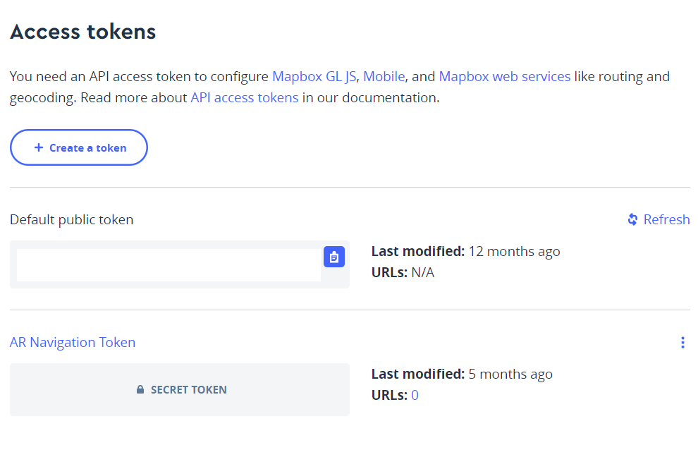
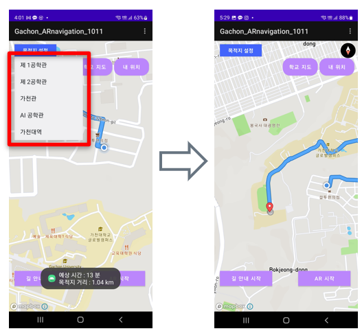

# Gachon AR Campus

# Index

- Introduction
- Features
- How to use
- Method explain
- Members

## Introduction

Gachon AR Navigation is a mobile app designed to help users navigate the Gachon University campus. By using augmented reality technology, the app displays real-time information about your surroundings, including building names, directions, and other points of interest. With Gachon AR Navigation, you can easily find your way around campus and explore all that Gachon University has to offer.

## Features

- Augmented reality view
- Real-time information about surroundings
- Building names and directions
- Firebase user authentication & bulletin board
- Points of interest
- Easy campus navigation

## How to use

1. Download and install the Gachon AR Navigation app from the App Store or Google Play Store.
2. Open the app and allow it to access your camera and location.
3. Point your camera at your surroundings to see building names, directions, and other points of interest.
4. Use the map to view your location and navigate around campus.
5. Enjoy exploring Gachon University with ease and convenience!

## Method explain

Gachon AR Navigation uses Mapbox SDK to create its augmented reality view. The SDK provides real-time location data and map rendering capabilities, allowing the app to display accurate and up-to-date information about your surroundings. With Mapbox SDK, Gachon AR Navigation is able to provide a seamless and intuitive navigation experience for users.


### How to Install Mapbox SDK Navigation

1. Go to the Mapbox website and create an account.
2. Once you have created an account, log in and go to the "Account" section.
3. Under the "Access Tokens" tab, create a new access token.
4. Copy the access token and paste it into your project's code.
5. Install the Mapbox SDK Navigation library using whatever package manager you are using for your project (e.g. npm, pip).
6. Import the Mapbox SDK Navigation library into your project's code.
7. You are now ready to use Mapbox SDK Navigation in your project!



### Method explain - getRoute

One of the key features of Gachon AR Navigation is its ability to provide directions to specific locations on the Gachon University campus. To achieve this, the app uses the Mapbox Directions API to generate routes between the user's current location and their desired destination. The getRoute function is a custom implementation of the Mapbox Directions API that is used to request and parse route data from the API. The function takes in the user's current location and their desired destination as input and returns a route object that includes step-by-step directions and estimated travel time. With this feature, users can easily navigate to any location on campus with confidence and ease.

```java
private void getRoute_navi_walking (Point origin, Point destinaton) {
        // TODO : https://docs.mapbox.com/android/navigation/overview/map-matching/
        NavigationRoute.builder(this).accessToken(Mapbox.getAccessToken())
                .profile(DirectionsCriteria.PROFILE_WALKING)//도보 길찾기
                .origin(origin)//출발지
                .destination(destinaton).//도착지
                build().
                getRoute(new Callback<DirectionsResponse>() {
                    @Override
                    public void onResponse(Call<DirectionsResponse> call, Response<DirectionsResponse> response) {
                        if (response.body() == null) {
                            return;
                        } else if (response.body().routes().size() ==0) {
                            return;
                        }
                        currentRoute = response.body().routes().get(0);
                        if (navigationMapRoute != null) {
                            navigationMapRoute.removeRoute();
                        } else {
                            navigationMapRoute = new NavigationMapRoute(null, mapView, mapboxMap, com.mapbox.services.android.navigation.ui.v5.R.style.NavigationMapRoute);
                        }
                        navigationMapRoute.addRoute(currentRoute);
                    }
                    @Override
                    public void onFailure(Call<DirectionsResponse> call, Throwable t) {
                    }
                });
    }
```

### Method explain - setDestination



Another key feature of Gachon AR Navigation is the ability to set a destination and receive turn-by-turn directions to that destination. When the user selects a destination on the app's map, the setDestination function is called. This function calculates the shortest route from the user's current location to the selected destination using the Mapbox Directions API. Once the route is calculated, the app displays turn-by-turn directions to the user, including distance and estimated travel time for each step of the route. With this feature, users can easily navigate to any location on campus with confidence and ease.

```java
@Override
            public void onClick(final View v) {
                final PopupMenu popupMenu = new PopupMenu(getApplicationContext(), v);
                getMenuInflater().inflate(R.menu.popup, popupMenu.getMenu());
                popupMenu.setOnMenuItemClickListener(new PopupMenu.OnMenuItemClickListener() {
                    @Override
                    public boolean onMenuItemClick(MenuItem item) {
                        //제 1공학관
                        if (item.getItemId() == R.id.action_menu1){
                            destination_zoom(37.45158,127.12795);
                        }
                        //제 2공학관
                        else if (item.getItemId() == R.id.action_menu2){
                            destination_zoom(37.45047,127.12842);
                        }
                        //가천관
                        else if (item.getItemId() == R.id.action_menu3){
                            destination_zoom(37.45048,127.12952);
                        }
                        //AI 공학관
                        else if (item.getItemId() == R.id.action_menu4){
                            destination_zoom(37.45532,127.13438);
                        }
                        //가천대역
                        else if (item.getItemId() == R.id.action_menu5){
                            destination_zoom(37.44939,127.12768);
                        }
                        //글로벌센터
                        else if (item.getItemId() == R.id.action_menu6){
                            destination_zoom(37.45191,127.12708);
                        }
                        //IT융합대학
                        else if (item.getItemId() == R.id.action_menu7){
                            destination_zoom(37.45099,127.12714);
                        }
                        //산학협력관
                        else if (item.getItemId() == R.id.action_menu8){
                            destination_zoom(37.44952,127.12945);
                        }
                        //한의과대학
                        else if (item.getItemId() == R.id.action_menu9){
                            destination_zoom(37.45004,127.12847);
                        }
                        //바이오나노연구원
                        else if (item.getItemId() == R.id.action_menu10){
                            destination_zoom(37.44988,127.12804);
                        }
                        //법과대학
                        else if (item.getItemId() == R.id.action_menu11){
                            destination_zoom(37.44925,127.12745);
                        }
                        //비전타워
                        else if (item.getItemId() == R.id.action_menu12){
                            destination_zoom(37.44967,127.12714);
                        }
                        //정문
                        else if (item.getItemId() == R.id.action_menu13){
                            destination_zoom(37.45050,127.12684);
                        }
                        //전자정보도서관
                        else if (item.getItemId() == R.id.action_menu14){
                            destination_zoom(37.45069,127.12852);
                        }
                        //학군단
                        else if (item.getItemId() == R.id.action_menu15){
                            destination_zoom(37.45152,127.12887);
                        }
                        //예술체육대학2
                        else if (item.getItemId() == R.id.action_menu16){
                            destination_zoom(37.45169,127.12963);
                        }
                        //예술체육대학1
                        else if (item.getItemId() == R.id.action_menu17){
                            destination_zoom(37.45214,127.12872);
                        }

                        //대학원
                        else if (item.getItemId() == R.id.action_menu18){
                            destination_zoom(37.45270,127.13006);
                        }
                        //교육대학원
                        else if (item.getItemId() == R.id.action_menu19){
                            destination_zoom(37.45187,127.13165);
                        }

                        //중앙도서관
                        else if (item.getItemId() == R.id.action_menu20){
                            destination_zoom(37.45228,127.13305);
                        }

                        //학생회관
                        else if (item.getItemId() == R.id.action_menu21){
                            destination_zoom(37.45318,127.13437);
                        }

                        //학생생활관(기숙사)
                        else if (item.getItemId() == R.id.action_menu22){
                            destination_zoom(37.45590,127.13464);
                        }
```

```xml
<!--목적지 설정 문자열열-->
    <string name="destination_setting">목적지 설정</string>
    <string name="College_of_Engineering_Building1">제 1공학관</string>
    <string name="College_of_Engineering_Building2">제 2공학관</string>
    <string name="AI_Hall">AI 공학관</string>
    <string name="Gachon_Univ_Station">가천대역</string>
    <string name="Global_Center">글로벌센터</string>
    <string name="BumJeong_Hall">IT융합대학</string>
    <string name="Humanities_Hall">산학협력관</string>
    <string name="Business_and_Economics_Hall">한의과대학</string>
    <string name="Education_Hall">바이오나노연구원</string>
    <string name="Hyedang_Hall">법과대학</string>
    <string name="Toegye_Memorial_Central_Library">비전타워</string>
    <string name="Graduate_School">정문</string>
    <string name="International_Hall">전자정보도서관</string>
    <string name="Laboratories">학군단</string>
```

```xml
<!--목적지 설정 버튼 팝업 메뉴 설정-->
    <item
        android:id="@+id/action_menu1"
        android:title="@string/College_of_Engineering_Building1"/>
    <item
        android:id="@+id/action_menu2"
        android:title="@string/College_of_Engineering_Building2" />
    <item
        android:id="@+id/action_menu3"
        android:title="@string/AI_Hall" />

    <item
        android:id="@+id/action_menu4"
        android:title="@string/Gachon_Univ_Station" />

    <item
        android:id="@+id/action_menu5"
        android:title="@string/Global_Center" />
```

### Method explain - get User Position

To provide real-time information about the user's surroundings, Gachon AR Navigation needs to constantly track the user's position. The getUserPosition function is responsible for retrieving the user's current location using the device's GPS or other location services. Once the user's location is obtained, the app uses Mapbox SDK to render a map of the user's surroundings and display relevant information, such as building names and directions. With this feature, users can easily navigate the Gachon University campus with confidence and ease.

1. Method to show location of the user

```java
private void enableLocationComponent(@NonNull Style loadedMapStyle) {
        Log.e(TAG,"enableLocationComponent 실행");
        // Check if permissions are enabled and if not request
        if (PermissionsManager.areLocationPermissionsGranted(this)) {
            // Activate the MapboxMap LocationComponent to show user location
            // Adding in LocationComponentOptions is also an optional parameter
            locationComponent = mapboxMap.getLocationComponent();
            locationComponent.activateLocationComponent(this, loadedMapStyle);
            locationComponent.setLocationComponentEnabled(true);
            // Set the component's camera mode
            locationComponent.setCameraMode(CameraMode.TRACKING);
            initLocationEngine();
        } else {
            permissionsManager = new PermissionsManager(this);
            permissionsManager.requestLocationPermissions(this);
        }
    }
private void initLocationEngine() {
        Log.e(TAG,"initLocationEngine 실행");
        locationEngine = LocationEngineProvider.getBestLocationEngine(this);
        LocationEngineRequest request = new LocationEngineRequest.Builder(DEFAULT_INTERVAL_IN_MILLISECONDS)
                .setPriority(LocationEngineRequest.PRIORITY_HIGH_ACCURACY)
                .setMaxWaitTime(DEFAULT_MAX_WAIT_TIME).build();
        locationEngine.requestLocationUpdates(request, callback, getMainLooper());
        locationEngine.getLastLocation(callback);
    }
```

1. Get Text from String.xml

```java
//안드로이드 기기 위치 추적
    //현재 위치 얻어오는 콜백
    class MainActivityLocationCallback implements LocationEngineCallback<LocationEngineResult> {
        private final WeakReference<MainActivity> activityWeakReference;
        MainActivityLocationCallback(MainActivity activity) {
            this.activityWeakReference = new WeakReference<>(activity);
        }
				/**
         * The LocationEngineCallback interface's method which fires when the device's location has changed.
         * @param result the LocationEngineResult object which has the last known location within it.
         */

        @Override
        public void onSuccess(LocationEngineResult result) {
            Log.e(TAG,"MainActivityLocationCallback onSuccess 실행");
            MainActivity activity = activityWeakReference.get();
            if (activity != null) {
                Location location = result.getLastLocation();
                if (location == null) {
                    return;
                }
                // Create a Toast which displays the new location's coordinates
                La = result.getLastLocation().getLatitude();
                Lo = result.getLastLocation().getLongitude();

                // Pass the new location to the Maps SDK's LocationComponent
                if (activity.mapboxMap != null && result.getLastLocation() != null) {
                    activity.mapboxMap.getLocationComponent().forceLocationUpdate(result.getLastLocation());
                }
            }
        }
```


## AR Explanation

This section will explain about AR Explanation function

### Unity AR + GPS Location Package

Package to support location based AR

details : [Unity AR+GPS Location | Unity AR+GPS Location Docs (v3.6.0)](https://docs.unity-ar-gps-location.com/#main-features)

### AR Foundation

Unity package that support to create multi-platform augmented reality apps with Unity.

It support to choose which AR features to enable by adding the corresponding manager components to unity scene.

details : [https://docs.unity3d.com/Packages/com.unity.xr.arfoundation@5.0/manual/index.html](https://docs.unity3d.com/Packages/com.unity.xr.arfoundation@5.0/manual/index.html)

### AR Core

AR Core is Google’s augmented reality SDK offering cross-platform APIs to build AR apps on Android, iOS, Unity, and Web.

details : [https://developers.google.com/ar](https://developers.google.com/ar)

### AR Image Tracking

When device camera tracked reference image (already trained) each prefabs will appear.

<details>

<summary>접기/펼치기</summary>

code example

```csharp
using System.Collections;
using System.Collections.Generic;
using UnityEngine;
using UnityEngine.XR.ARFoundation;
using UnityEngine.XR.ARSubsystems;

public class ARTrackedMultiImageManager : MonoBehaviour
{
    [SerializeField]
    // 모든 prefab 목록
    private GameObject[] trackedPrefabs;

    // 이미지 인식 후 출력되는 오브젝트 목록
    private Dictionary<string, GameObject> spawnedObjects = new Dictionary<string, GameObject>();
    private ARTrackedImageManager trackedImageManager;

    private void Awake()
    {
        trackedImageManager = GetComponent<ARTrackedImageManager>();

        foreach(GameObject prefab in trackedPrefabs)
        {
            GameObject clone = Instantiate(prefab);// object 생성
            clone.name = prefab.name; // object 이름 설정
            clone.SetActive(false); // object 비활성화 (활성화 시 보이게 됨)
            spawnedObjects.Add(clone.name, clone); // dictionary 형태로 저장
        }
    }

    // 인식 O
    private void OnEnable()
    {
        trackedImageManager.trackedImagesChanged += OnTrackedImagesChanged;
    }

    // 인식 X
    private void OnDisable()
    {
        trackedImageManager.trackedImagesChanged -= OnTrackedImagesChanged;
    }

    private void OnTrackedImagesChanged(ARTrackedImagesChangedEventArgs eventArgs)
    {
        foreach(var trackedImage in eventArgs.added)
        {
            UpdateImage(trackedImage);
        }

        foreach (var trackedImage in eventArgs.updated)
        {
            UpdateImage(trackedImage);
        }

        foreach (var trackedImage in eventArgs.removed)
        {
            spawnedObjects[trackedImage.name].SetActive(false);
        }
    }

    // 인식된 image에 따라 object 출력
    private void UpdateImage(ARTrackedImage trackedImage)
    {
        string name = trackedImage.referenceImage.name;
        GameObject trackedObject = spawnedObjects[name];

        // tracking 이면 출력
        if(trackedImage.trackingState == TrackingState.Tracking)
        {
            trackedObject.transform.position = trackedImage.transform.position;
            trackedObject.transform.rotation = trackedImage.transform.rotation;
            trackedObject.SetActive(true);
        }

        // tracking 아니면 미출력
        else
        {
            trackedObject.SetActive(false);
        }
    }
}
```

</details>

### Prefab touch event

When image tracked each prefabs will appear. User can touch those prefab and make event. each touch for each prefab make move to each scenes.

<details>

<summary>접기/펼치기</summary>

code example

```csharp
using System.Collections;
using System.Collections.Generic;
using UnityEngine;
using UnityEngine.SceneManagement;

public class mainscript : MonoBehaviour
{
    public void newObject(string objName, Vector3 pos)
    {
        Instantiate(Resources.Load(objName), pos, Quaternion.identity);
    }
    void Update()
    {
        if (Application.platform == RuntimePlatform.Android)
        {
            if (Input.GetKey(KeyCode.Escape))
            {
                Application.Quit();
            }

            if(Input.touchCount > 0)
            {
                Touch touch = Input.GetTouch(0);
                Ray ray;
                RaycastHit hit;

                switch (touch.phase)
                {
                    case TouchPhase.Began:
                        ray = Camera.main.ScreenPointToRay(touch.position);
                        Physics.Raycast(ray, out hit, Mathf.Infinity);

                        if(hit.collider != null)
                        {
                            Debug.Log(touch.position);
                            Debug.Log(hit.collider.gameObject.name);
                            switch (hit.collider.gameObject.name)
                            {
                                case "art1":
                                    Debug.Log("art1");
                                    SceneManager.LoadScene("art1");
                                    break;

                                case "emblem":
                                    Debug.Log("emblem");
                                    SceneManager.LoadScene("infinity");
                                    break;
                                case "art2":
                                    Debug.Log("art2");
                                    SceneManager.LoadScene("art2");
                                    break;
                                case "biology":
                                    Debug.Log("biology");
                                    SceneManager.LoadScene("biology");
                                    break;
                                case "engineering1":
                                    Debug.Log("engineering1");
                                    SceneManager.LoadScene("engineering1");
                                    break;
                                case "engineering2":
                                    Debug.Log("engineering2");
                                    SceneManager.LoadScene("engineering2");
                                    break;
                                case "global":
                                    Debug.Log("global");
                                    SceneManager.LoadScene("global");
                                    break;
                                case "ittech":
                                    Debug.Log("ittech");
                                    SceneManager.LoadScene("ittech");
                                    break;
                                case "ladybug":
                                    Debug.Log("ladybug");
                                    SceneManager.LoadScene("ladybug");
                                    break;
                                case "subway":
                                    Debug.Log("subway");
                                    SceneManager.LoadScene("subway");
                                    break;

                            }
                        }
                        break;
                }
            }
        }
    }

}
```

</details>

## Setting Firebase

The Firebase Realtime database is a real-time database that can be accessed directly from the client side to perform applications. In addition, events occur when data is maintained locally and offline, so it can provide convenient functions to users.

You have to do pre-work before using firebase database.

### Firebase Join

-Necessity
1. Google account 
2. Android studio application

Process
Create Firebase project(setting name & Google Analytics

details : 
https://firebase.google.com/docs/projects/learn-more?hl=ko

### Link with android studio

Process   
1. press the [sawwheel icon]–[Project Settings] button under the Firebase logo at the top of the screen, there is the same button as the one you saw earlier.<br/><br/>   
2. Create the package name and app nickname for Android in the order it appears on the screen. The app nickname is written by the developer to find out, so you don't have to write it the same as the image below.<br/><br/>   
3. Click Register App to continue. You can copy the package name separately and paste it as it is while creating the Android project.<br/><br/>   
4. Create an Android project before proceeding to the next step. Turn on Android Studio, select Empty Activity, and create a new project named Firebase.<br/><br/>   
5. Paste the firebase name you created in 2. into the package name. After you finish creating, click the [Finish] button to create the project.<br/><br/>   
6. Go back to the Firebase website and click [download google-services.json] to download the json file.<br/><br/>   
7. Go back to Android Studio, and then drop the downloaded json file under the [Firebase]-[app] directory.<br/><br/>   
<br/><br/>
8. You must now add the Firebase SDK to your Android. Go back to the Firebase website and click Next to see the code you want to modify. Select Java as the code to add.<br/><br/>
9. Go back to Android Studio, open the build.gradle (Project:) file, and insert the SDK additional code provided by the Firebase website. The official site tells you to add multiple lines, but in reality, you only need to add one line to the dependencies.<br/><br/>
10. Next, open the build.gradle(Module:) file and add the code. Add one line of id to the top plugins and two dependencies to the bottom dependencies.<br/><br/>

```
plugins {
	id 'com.google.gms.google-services' 
}
dependencies {
     implementation platform('com.google.firebase:firebase-bom:29.0.0')
     implementation 'com.google.firebase:firebase-analytics-ktx' 
}

```

11. Click to apply [Sync Now] in the upper right corner of Android Studio.<br/><br/>

12. Go back to the Firebase website and click Next to complete the setup.<br/><br/>
13. Click [Tools – Firebase – Realtime Database] to check link.<br/><br/>
<br/><br/>

### Using Log in & Sign in with android studio

To make function that sign in & log in, the database and application have to give token and get token. The token must send to firebase and server give id token to application to get login. The receive data is 3types(name, email, and password). The user can register name, email & password, the id token is automatically register.<br/><br/>

### Sign in

Using FirebaseAuth, the authentication function operate and user`s email & password are go to firebase. The email & password are save in user data form and id token also given to ID.
It will use in bulletin Board.

```
setContentView(R.layout.activity_register);

        mFirebaseAuth = FirebaseAuth.getInstance();
        mDatabaseReference = FirebaseDatabase.getInstance().getReference("FirebaseEmailAccount");

        et_email = findViewById(R.id.email);
        et_pwd = findViewById(R.id.passWord);
        et_name = findViewById(R.id.name);
        btn_register = findViewById(R.id.btn_register);

        btn_register.setOnClickListener(v -> {
            String strEmail = et_email.getText().toString();
            String strPwd = et_pwd.getText().toString();
            String strName = et_name.getText().toString();

            mFirebaseAuth.createUserWithEmailAndPassword(strEmail, strPwd).addOnCompleteListener(RegisterActivity.this, new OnCompleteListener<AuthResult>() {
                @Override
                public void onComplete(@NonNull Task<AuthResult> task) { //유저가 다 만들어졌을 때
                    if(task.isSuccessful()) {
                        FirebaseUser firebaseUser =mFirebaseAuth.getCurrentUser(); //로그인을 성공해서 가능한 것
                        UserAccount account = new UserAccount();
                        account.setEmail(firebaseUser.getEmail());
                        account.setPassword(strPwd);
                        account.setIdToken(firebaseUser.getUid());

                        //database에 저장
                        mDatabaseReference.child("userAccount").child(firebaseUser.getUid()).setValue(account);

                        Toast.makeText(RegisterActivity.this, "회원가입에 성공하셨습니다.", Toast.LENGTH_SHORT).show();
                        Intent intent = new Intent(RegisterActivity.this, loginActivity.class);
                        startActivity(intent);
                    }
                    else {
                        Toast.makeText(RegisterActivity.this, "회원가입에 실패하셨습니다.", Toast.LENGTH_SHORT).show();
                    }
                }
            });
        });

```

### User data

```
public class UserAccount {
    private String email;
    private String password;
    private String idToken;
    private String name;

    public void setIdToken(String idToken) {
        this.idToken = idToken;
    }

    public String getIdToken() {
        return idToken;
    }

    public UserAccount() { } //빈 생성자가 필요 (firebase 관련)

    public String getEmail() {
        return email;
    }

    public String getPassword() {
        return password;
    }

    public String getName() {
        return name;
    }

    public void setEmail(String email) {
        this.email = email;
    }

    public void setPassword(String password) {
        this.password = password;
    }

    public void setName(String name){
        this.name = name;
    }


}
```

### Log in

```
mFirebaseAuth = FirebaseAuth.getInstance();

        et_email = findViewById(R.id.email);
        et_pwd = findViewById(R.id.passWord);

        btn_login = findViewById(R.id.btn_login);
        btn_login.setOnClickListener(v -> {
            String strEmail = et_email.getText().toString();
            String strPwd = et_pwd.getText().toString();

            mFirebaseAuth.signInWithEmailAndPassword(strEmail, strPwd).addOnCompleteListener(loginActivity.this, new OnCompleteListener<AuthResult>() {
                @Override
                public void onComplete(@NonNull Task<AuthResult> task) {
                    if(task.isSuccessful()) {
                        Intent intent = new Intent(loginActivity.this, home_Activity.class);
                        startActivity(intent);
                        finish();
                    } else {
                        Toast.makeText(loginActivity.this, "로그인 실패", Toast.LENGTH_SHORT).show();
                    }
                }
            });
        });
    }

}
```

## Members
**임시우** | siwoo5530@gmail.com  
**이준희** |   
**이종은** |   
